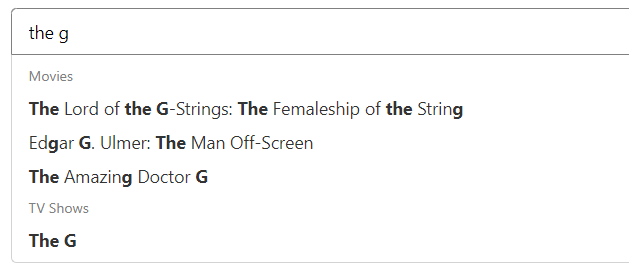

## Intro
A data-list like search bar made by Svelte,
feel free to re-contribute it on commercial-use.


1. Display data with its max limit in group structure
1. Highlight matched words.
1. Avoid calling the API server excessively no matter how fast user type.


## Usage
1. 
create .env, e.g.
```
apiUrl=https://www.omdbapi.com/?apikey=[yourkey]&s=
```
2.  
```
npm run dev
```
